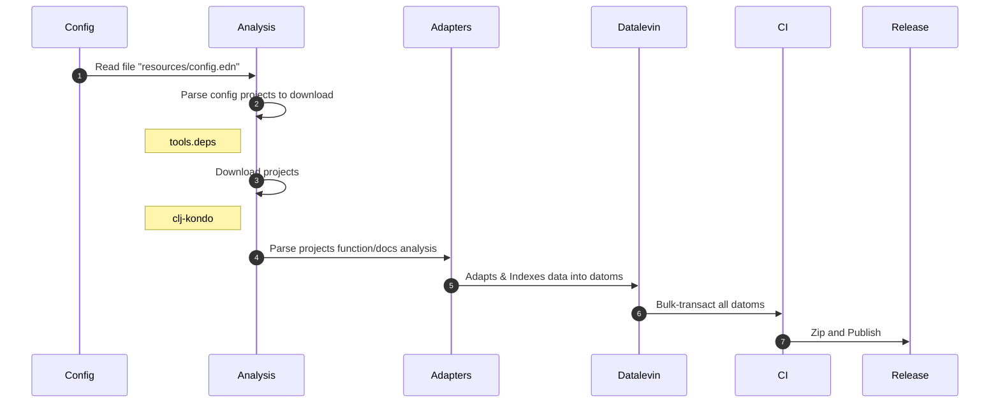

# codes.clj.docs/extractor

Tool to extract namespace/functions documentation from Clojure projects into indexed [datalevin](https://github.com/juji-io/datalevin) file.

# CLI

## Extract and generate datalevin file
```bash
clojure -X:extract
```

# Flow



# Using
Go to this github [release page](https://github.com/clj-codes/docs.extractor/releases), download and unzip the `docs-db.zip` file.

## Connecting
Since `v.0.3.0`, because of the new full-text index analyzers, this database requires this minimal connection opts to be used:
```clojure
(require '[datalevin.core :as d]
         '[datalevin.search-utils :as su]
         '[datalevin.interpret :refer [inter-fn]])

(defn merge-tokenizers
  "Merges the results of tokenizer a and b into one sequence."
  [tokenizer-a tokenizer-b]
  (inter-fn [^String s]
    (into (sequence (tokenizer-a s))
      (sequence (tokenizer-b s)))))

(def conn-opts
  (let [query-analyzer (su/create-analyzer
                        {:tokenizer (merge-tokenizers
                                     (inter-fn [s] [[s 0 0]])
                                     (su/create-regexp-tokenizer #"[\s:/\.;,!=?\"'()\[\]{}|<>&@#^*\\~`\-]+"))
                         :token-filters [su/lower-case-token-filter]})]
    {:search-domains {"project-name" {:query-analyzer query-analyzer}
                      "namespace-name" {:query-analyzer query-analyzer}
                      "definition-name" {:query-analyzer query-analyzer}}}))

(d/get-conn "path/to/db" nil conn-opts)
```

## Tools used
- [tools.deps](https://github.com/clojure/tools.deps) Download projects/libraries
- [clj-kondo](https://github.com/clj-kondo/clj-kondo) Parses/Analyses projects data
- [datalevin](https://github.com/juji-io/datalevin) Indexing and Storage of the data

# Developing

## Repl
```bash
clojure -M:dev:nrepl
```

## Tests
```bash
clojure -M:dev:test
```

## Build
```bash
clojure -T:build uberjar
```

# Other iterations
- https://github.com/rafaeldelboni/clojure-document-extractor

# License
This is free and unencumbered software released into the public domain.  
For more information, please refer to <http://unlicense.org>
