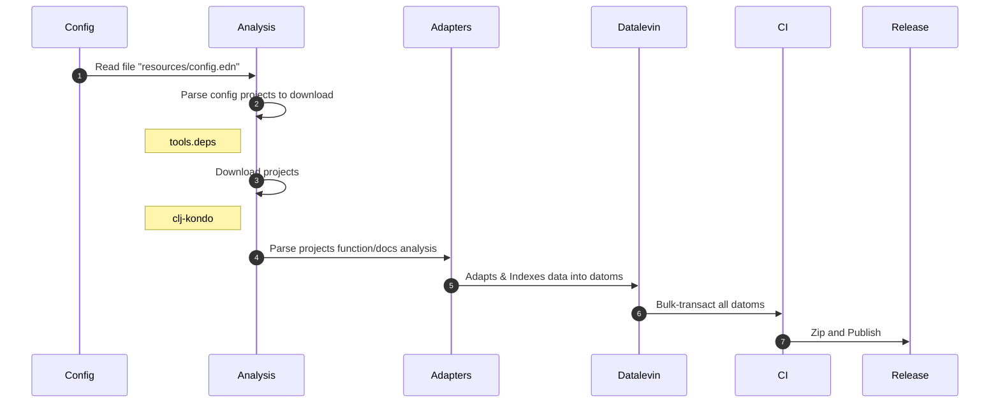

# codes.clj.docs/extractor

Tool to extract namespace/functions documentation from Clojure projects into indexed [datalevin](https://github.com/juji-io/datalevin) file.

# CLI

## Extract and generate datalevin file
```bash
clojure -X:extract
```

# Flow



## Tools used
- [tools.deps](https://github.com/clojure/tools.deps) Download projects/libraries
- [clj-kondo](https://github.com/clj-kondo/clj-kondo) Parses/Analyses projects data
- [datalevin](https://github.com/juji-io/datalevin) Indexing and Storage of the data

# Developing

## Repl
```bash
clojure -M:dev:nrepl
```

## Tests
```bash
clojure -M:dev:test
```

## Build
```bash
clojure -T:build uberjar
```

# Other iterations
- https://github.com/rafaeldelboni/clojure-document-extractor

# License
This is free and unencumbered software released into the public domain.  
For more information, please refer to <http://unlicense.org>
